# 👨‍💻 My Fullstack Portfolio


> A showcase of my journey as a Fullstack Developer, focusing on clean architecture, modern UI patterns, and high-performance web applications.


## 🚀 About the Project

This repository hosts my personal professional portfolio. More than just a showcase, this project represents my philosophy as a developer: **Minimalism, Efficiency, and Scalability.**

I built this using a **Component-Driven Development (CDD)** approach, ensuring that every button, card, and section is a reusable, accessible entity. The design leverages **shadcn/ui** components on top of **Tailwind CSS** to create a theme-aware (Dark/Light mode) and fully responsive experience.

## 🏗️ Architecture & Design System

Since this is a presentation layer project, the architecture focuses on the efficient flow of components and routing. Below is the structure of how the application handles navigation and component reuse:

```mermaid
graph TD
    %% Styles
    classDef router fill:#e1f5fe,stroke:#0277bd,stroke-width:2px,color:#000;
    classDef pages fill:#f3e5f5,stroke:#7b1fa2,stroke-width:2px,color:#000;
    classDef ui fill:#e0f2f1,stroke:#00695c,stroke-width:2px,color:#000;
    classDef core fill:#fff9c4,stroke:#fbc02d,stroke-width:2px,color:#000;

    %% Nodes
    Entry(Main Entry / App.tsx):::core
    
    subgraph Navigation ["🧭 Routing Layer"]
        Router{React Router}:::router
        Layout[Main Layout Wrapper]:::router
    end

    subgraph Screens ["📄 Page Views"]
        direction TB
        Home[Home / Hero Section]:::pages
        Projects[Projects Showcase]:::pages
        About[About & Skills]:::pages
        Contact[Contact Form]:::pages
    end

    subgraph DesignSystem ["🎨 Design System (shadcn/ui)"]
        UI1[Button / Inputs]:::ui
        UI2[Cards / Containers]:::ui
        UI3[Theme Provider]:::ui
    end

    %% Connections
    Entry --> Router
    Router --> Layout
    Layout --> Home & Projects & About & Contact
    
    %% Dependency Links
    UI3 -.->|Wraps Application| Entry
    Home & Projects & About & Contact -.->|Consumes| UI1 & UI2
```



## 🛠️ Tech Stack

I selected this stack to ensure the fastest possible **TTI (Time to Interactive)** and excellent **DX (Developer Experience)**.

### **Core & Logic**
*  **React 18+**: Utilizing concurrent features and hooks for responsive UIs.
*  **TypeScript**: For strict type safety, better tooling, and long-term maintainability.

### **Build Tooling**
*  **Vite**: Chosen over Create React App for its ESBuild-based compilation speed and instant hot module replacement (HMR).

### **UI & Styling**
*  **Tailwind CSS**: A utility-first framework for rapid styling without CSS bloat.
*  **shadcn/ui**: A collection of re-usable components built using Radix UI and Tailwind CSS for consistency.
*  **Lucide React**: For lightweight, consistent, and tree-shakeable iconography.

---

## 🎨 Key Features

| Feature | Description |
| :--- | :--- |
| **⚡ High Performance** | Optimized assets and lazy loading for distinct sections to ensure fast load times. |
| **📱 Mobile First** | Design starts from small screens and scales up elegantly to desktops. |
| **🌗 Dark Mode** | Integrated theme switching interacting directly with system preferences. |
| **♿ Accessible** | Components follow WAI-ARIA guidelines (via Radix UI primitives) for inclusivity. |

---

## 📦 Getting Started Locally

To run this portfolio on your machine, follow these steps:

1. **Clone the repository:**
```bash

   git clone [https://github.com/IsraelPina32/seu-repositorio.git](https://github.com/IsraelPina32/seu-repositorio.git)

 ```
2. **Install dependencies:**
```bash
    cd seu-repositorio
    npm install
```
3. **Run the development server:**
```bash
npm run dev
```
4. **Access the project: Open your browser at http://localhost:5173.**